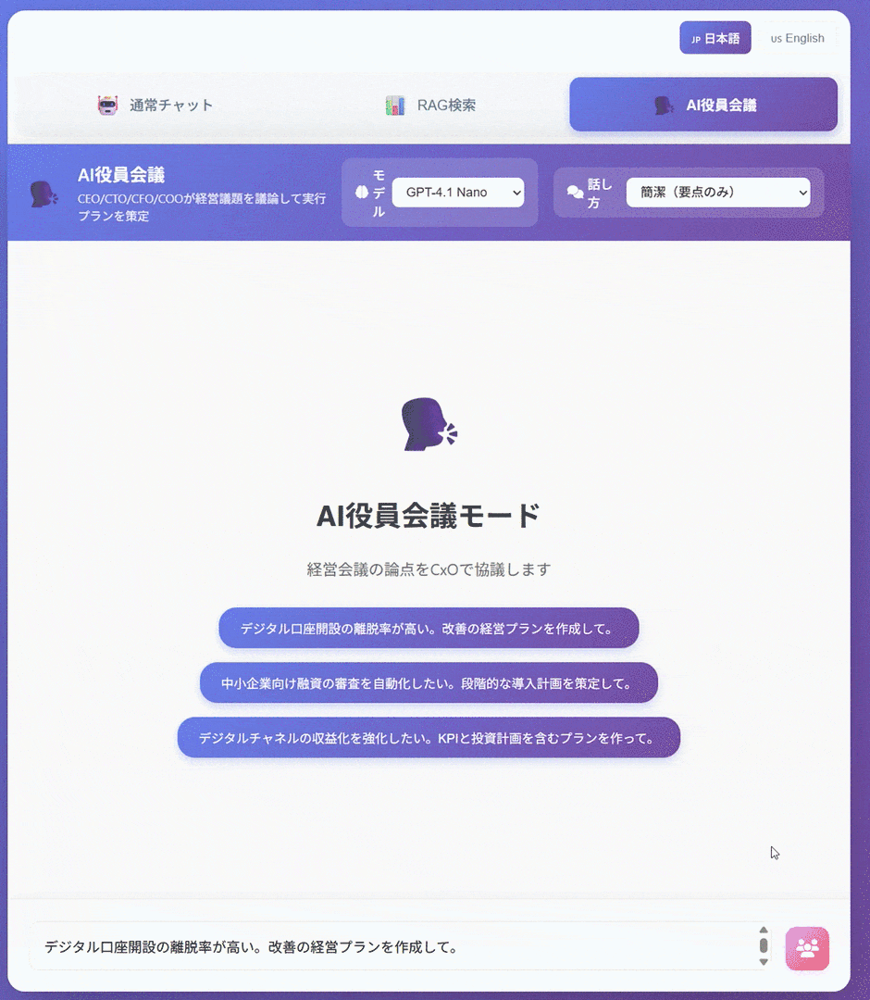

# Concurrent Streaming Demo with Microsoft Agent Framework

ワークフローで**複数エージェントを並列実行**しつつ、生成中の出力を**ストリーミング表示**するPythonデモです。
ブラウザ→Frontend(Flask)→Backend(FastAPI)の2段構成で、HTTP Chunked Transferを使って「出力が届き次第UIに描画」します。

> English version: [README.md](README.md)

## 機能紹介（このリポジトリでできること）

- **通常チャット（Text streaming）**: 1エージェントの出力をトークン/チャンク単位で表示
- **マルチエージェント分析（ConcurrentBuilder）**: 2エージェントを並列実行（Critical / Positive）し、最後にSynthesizerが統合
- **RAG検索（Text streaming）**: Azure AI Search（任意）を使った参照（出典）付き応答
- **AI役員会議（GroupChatBuilder）**: CEO/CTO/CFO/COO が前の人の意見を踏まえながら順番に発言し、COOが実行計画をまとめる（tone指定あり）
- **モデル選択**: リクエストごとに `model` を指定（デプロイ名のマッピングは環境変数で上書き可能）
- **簡易セッション履歴**: Frontendがメモリに履歴を保持（本番はRedis等を推奨）


### マルチエージェント分析（ConcurrentBuilder）


### AI役員会議（GroupChatBuilder）


## アーキテクチャ概要

- **Frontend**: Flask（port 5000）
    - ブラウザへHTML/JSを配信
    - ブラウザからのリクエストを受け、Backendにストリーミングで中継（プロキシ）
- **Backend**: FastAPI（port 8000）
    - Microsoft Agent Frameworkを使ってエージェント実行
    - Azure OpenAIを呼び出し、結果をストリーミング返却

主要な呼び出し経路（例: 通常チャット）:

```
Browser (Fetch streaming)
    -> Frontend: POST /api/chat/stream
        -> Backend: POST /api/stream
            -> Azure OpenAI
```

## 必要要件

- Python 3.10以上
- （推奨）Windows + PowerShell
- Azureへデプロイする場合: Azure CLI（`az`）

## セットアップ（ローカル）

### 1) 依存関係のインストール

任意の仮想環境でOKです（venv / condaなど）。

```powershell
python -m venv .venv
.\.venv\Scripts\Activate.ps1

pip install -r .\Backend\requirements.txt
pip install -r .\Frontend\requirements.txt
```

> `start.ps1` / `start.bat` は、現在のPython実行環境でそのまま起動します。実行前に venv/conda などの環境を有効化してください。

### 2) 環境変数（Backend: Azure OpenAI）

Backendは起動時に`Backend/.env`を読み込みます。
`Backend/.env.example` を `Backend/.env` にコピーして値を設定してください（**秘密情報はコミットしない**）。

```
AZURE_OPENAI_API_KEY=...
AZURE_OPENAI_ENDPOINT=https://<your-resource>.openai.azure.com/
AZURE_OPENAI_DEPLOYMENT=<your-deployment-name>
```

（任意）Azure AI Searchを使う場合（RAG検索）:

```
SEARCH_ENDPOINT=https://<your-search>.search.windows.net
SEARCH_API_KEY=...
SEARCH_INDEX_NAME=...
SEARCH_SEMANTIC_CONFIG=default
```

（任意）言語切り替え:

```
LANGUAGE=ja
# または
LANGUAGE=en
```

※Backendは起動時に`LANGUAGE`を読み込むため、変更後はBackendの再起動が必要です。

（任意）モデル名 → デプロイ名のマッピング上書き:

```
AZURE_OPENAI_DEPLOYMENT_GPT41=<deployment-for-gpt-4.1>
AZURE_OPENAI_DEPLOYMENT_GPT41_MINI=<deployment-for-gpt-4.1-mini>
AZURE_OPENAI_DEPLOYMENT_GPT41_NANO=<deployment-for-gpt-4.1-nano>
AZURE_OPENAI_DEPLOYMENT_GPT52=<deployment-for-gpt-5.2>
AZURE_OPENAI_DEPLOYMENT_GPT52_CHAT=<deployment-for-gpt-5.2-chat>
```

### 3) 実行

#### A. 個別起動（推奨：環境依存が少ない）

ターミナルを2つ開きます。

Backend:

```powershell
cd .\Backend
python -m uvicorn app:app --host 127.0.0.1 --port 8000 --reload
```

Frontend:

```powershell
cd .\Frontend
python app.py
```

起動後:

- Frontend: http://localhost:5000
- Backend: http://localhost:8000

#### B. 同時起動スクリプト

```powershell
# PowerShell
.\start.ps1

# もしくは cmd / PowerShell
.\start.bat
```

開発用（auto-reloadを強める）:

```powershell
.\start-dev.ps1
# または
.\start-dev.bat
```

### 4) Frontend の環境変数（任意）

Frontendは`BACKEND_URL`を見てBackendに接続します。

```powershell
$env:BACKEND_URL = "http://localhost:8000"
$env:LANGUAGE = "ja"
python .\Frontend\app.py
```

## 使い方（UI）

1. ブラウザで http://localhost:5000 を開く
2. 入力欄にプロンプトを入れて送信
3. ボタンでモードを切替（通常 / マルチ / RAG / 井戸端）
4. `model`セレクターがある場合はモデルを選択（デフォルトは`gpt-4.1-mini`）

## Azure Container Apps へデプロイ

このリポジトリはBackend(FastAPI)とFrontend(Flask)を**別々のContainer App**としてデプロイします。
デプロイはscripts/deploy-aca.ps1で自動化されています。

### 前提条件

- Azure CLI（`az`）をインストール済み
- `az login` 済み
- リソース作成権限（Resource Group / ACR / Log Analytics / Container Apps）
- PowerShell 7（`pwsh`）推奨（Windows PowerShell 5.1でも可）

### 必須の環境変数（Backend 作成時）

PowerShellで以下を設定してから実行します（スクリプトは**Backend初回作成時**に必須チェックを行います）。

```powershell
$env:AZURE_OPENAI_API_KEY = "..."
$env:AZURE_OPENAI_ENDPOINT = "https://<your-resource>.openai.azure.com/"
$env:AZURE_OPENAI_DEPLOYMENT = "..."
```

（任意）Azure AI Search:

```powershell
$env:SEARCH_ENDPOINT = "https://<your-search>.search.windows.net"
$env:SEARCH_API_KEY = "..."
$env:SEARCH_INDEX_NAME = "..."
$env:SEARCH_SEMANTIC_CONFIG = "default"
```

### デプロイ実行

```powershell
pwsh .\scripts\deploy-aca.ps1 -Location japaneast -ResourceGroup concurrent-streaming-demo-rg

# Windows PowerShell 5.1 の場合
powershell -File .\scripts\deploy-aca.ps1 -Location japaneast -ResourceGroup concurrent-streaming-demo-rg
```

（任意）サブスクリプション指定:

```powershell
pwsh .\scripts\deploy-aca.ps1 -SubscriptionId <your-subscription-id> -ResourceGroup concurrent-streaming-demo-rg
```

作成/更新されるもの（概要）:

- Resource Group
- Azure Container Registry（`az acr build`でBackend/Frontendをビルド）
- Log Analytics Workspace
- Container Apps Environment
- Container Apps
    - Backend: ingress internal / port 8000
    - Frontend: ingress external / port 5000（`BACKEND_URL=http://concurrent-streaming-backend` を設定）

完了するとFrontendのURL（`https://<fqdn>`）が出力されます。

#### Frontend だけ更新したい場合

```powershell
pwsh .\scripts\deploy-aca.ps1 -FrontendOnly -ResourceGroup concurrent-streaming-demo-rg
```

## トラブルシューティング

- **何も返らない / 設定不足**: `Backend/.env`のAzure OpenAI設定（API key/endpoint/deployment）を確認
- **429 (Too Many Requests)**: 同時実行が多いとAzure OpenAI側の制限に当たりやすいので、負荷試験の同時数を下げる/モデルを軽くする

## ライセンス

MIT License
