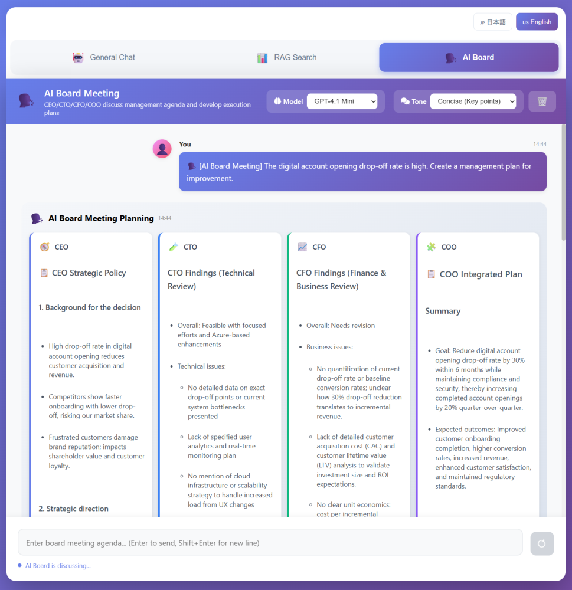

# Concurrent Streaming Demo with Microsoft Agent Framework

This is a Python demo that **runs multiple agents in parallel** inside a workflow and **streams partial outputs** while generation is in progress.
It is a 2-tier setup: Browser → Frontend (Flask) → Backend (FastAPI). It uses HTTP Chunked Transfer so the UI can render output as soon as it arrives.

> 日本語版: [README.ja.md](README.ja.md)

## Feature Overview (What you can do in this repo)

- **Regular chat (Text streaming)**: Display a single agent’s output token/chunk by token/chunk
- **Multi-agent analysis (ConcurrentBuilder)**: Run two agents in parallel (Critical / Positive), then a Synthesizer merges the results
- **RAG search (Text streaming)**: Referenced responses using Azure AI Search (optional)
- **AI board meeting (GroupChatBuilder)**: The CEO, CTO, CFO, and COO speak in turn, building on each other's points, with the COO compiling the implementation plan. (with `tone`)
- **Model selection**: Specify `model` per request (deployment mapping can be overridden via environment variables)
- **Lightweight session history**: The Frontend keeps history in memory (use Redis, etc. in production)

### Multi-agent analysis (ConcurrentBuilder)


### AI board meeting (GroupChatBuilder)


## Architecture Overview

- **Frontend**: Flask (port 5000)
    - Serves HTML/JS to the browser
    - Receives browser requests and proxies them to the Backend with streaming
- **Backend**: FastAPI (port 8000)
    - Executes agents using Microsoft Agent Framework
    - Calls Azure OpenAI and streams the output back

Main call path (example: regular chat):

```
Browser (Fetch streaming)
    -> Frontend: POST /api/chat/stream
        -> Backend: POST /api/stream
            -> Azure OpenAI
```

## Requirements

- Python 3.10+
- (Recommended) Windows + PowerShell
- For Azure deployment: Azure CLI (`az`)

## Setup (Local)

### 1) Install dependencies

Any virtual environment is fine (venv / conda, etc.).

```powershell
python -m venv .venv
.\.venv\Scripts\Activate.ps1

pip install -r .\Backend\requirements.txt
pip install -r .\Frontend\requirements.txt
```

> `start.ps1` / `start.bat` run servers using the current Python environment. Activate your venv/conda environment before running them.

### 2) Environment variables (Backend: Azure OpenAI)

The Backend loads `Backend/.env` at startup.
Copy `Backend/.env.example` to `Backend/.env` and set the values (**do not commit secrets**).

```
AZURE_OPENAI_API_KEY=...
AZURE_OPENAI_ENDPOINT=https://<your-resource>.openai.azure.com/
AZURE_OPENAI_DEPLOYMENT=<your-deployment-name>
```

(Optional) If you use Azure AI Search (RAG search):

```
SEARCH_ENDPOINT=https://<your-search>.search.windows.net
SEARCH_API_KEY=...
SEARCH_INDEX_NAME=...
SEARCH_SEMANTIC_CONFIG=default
```

(Optional) Language switch:

```
LANGUAGE=ja
# or
LANGUAGE=en
```

Note: the Backend reads `LANGUAGE` at startup, so you need to restart the Backend to apply changes.

(Optional) Override model name → deployment name mapping:

```
AZURE_OPENAI_DEPLOYMENT_GPT41=<deployment-for-gpt-4.1>
AZURE_OPENAI_DEPLOYMENT_GPT41_MINI=<deployment-for-gpt-4.1-mini>
AZURE_OPENAI_DEPLOYMENT_GPT41_NANO=<deployment-for-gpt-4.1-nano>
AZURE_OPENAI_DEPLOYMENT_GPT52=<deployment-for-gpt-5.2>
AZURE_OPENAI_DEPLOYMENT_GPT52_CHAT=<deployment-for-gpt-5.2-chat>
```

### 3) Run

#### A. Run separately (recommended: fewer environment assumptions)

Open two terminals.

Backend:

```powershell
cd .\Backend
python -m uvicorn app:app --host 127.0.0.1 --port 8000 --reload
```

Frontend:

```powershell
cd .\Frontend
python app.py
```

After startup:

- Frontend: http://localhost:5000
- Backend: http://localhost:8000

#### B. Combined start scripts

```powershell
# PowerShell
.\start.ps1

# or cmd / PowerShell
.\start.bat
```

Dev mode (stronger auto-reload):

```powershell
.\start-dev.ps1
# or
.\start-dev.bat
```

### 4) Frontend environment variables (optional)

The Frontend connects to the Backend via `BACKEND_URL`.

```powershell
$env:BACKEND_URL = "http://localhost:8000"
$env:LANGUAGE = "ja"
python .\Frontend\app.py
```

## How to use (UI)

1. Open http://localhost:5000 in your browser
2. Enter a prompt and send
3. Switch modes via buttons (regular / multi / RAG / board meeting)
4. If there is a `model` selector, choose the model (default is `gpt-4.1-mini`)

## Deploy to Azure Container Apps

This repo deploys Backend (FastAPI) and Frontend (Flask) as **separate Container Apps**.
Deployment is automated by scripts/deploy-aca.ps1.

### Prerequisites

- Azure CLI (`az`) installed
- Logged in via `az login`
- Permission to create resources (Resource Group / ACR / Log Analytics / Container Apps)
- PowerShell 7 (`pwsh`) recommended (Windows PowerShell 5.1 also works)

### Required environment variables (when creating the Backend)

Set these in PowerShell before running (the script validates them **only when the Backend is created for the first time**).

```powershell
$env:AZURE_OPENAI_API_KEY = "..."
$env:AZURE_OPENAI_ENDPOINT = "https://<your-resource>.openai.azure.com/"
$env:AZURE_OPENAI_DEPLOYMENT = "..."
```

(Optional) Azure AI Search:

```powershell
$env:SEARCH_ENDPOINT = "https://<your-search>.search.windows.net"
$env:SEARCH_API_KEY = "..."
$env:SEARCH_INDEX_NAME = "..."
$env:SEARCH_SEMANTIC_CONFIG = "default"
```

### Run deployment

```powershell
pwsh .\scripts\deploy-aca.ps1 -Location japaneast -ResourceGroup concurrent-streaming-demo-rg

# For Windows PowerShell 5.1
powershell -File .\scripts\deploy-aca.ps1 -Location japaneast -ResourceGroup concurrent-streaming-demo-rg
```

(Optional) Specify subscription:

```powershell
pwsh .\scripts\deploy-aca.ps1 -SubscriptionId <your-subscription-id> -ResourceGroup concurrent-streaming-demo-rg
```

What gets created/updated (high level):

- Resource Group
- Azure Container Registry (build Backend/Frontend via `az acr build`)
- Log Analytics Workspace
- Container Apps Environment
- Container Apps
    - Backend: ingress internal / port 8000
    - Frontend: ingress external / port 5000 (sets `BACKEND_URL=http://concurrent-streaming-backend`)

After completion, it prints the Frontend URL (`https://<fqdn>`).

#### Update only the Frontend

```powershell
pwsh .\scripts\deploy-aca.ps1 -FrontendOnly -ResourceGroup concurrent-streaming-demo-rg
```

## Troubleshooting

- **No response / missing configuration**: Check Azure OpenAI settings in `Backend/.env` (API key/endpoint/deployment)
- **429 (Too Many Requests)**: With high concurrency you may hit Azure OpenAI limits; reduce load-test concurrency / use a lighter model

## License

MIT License
